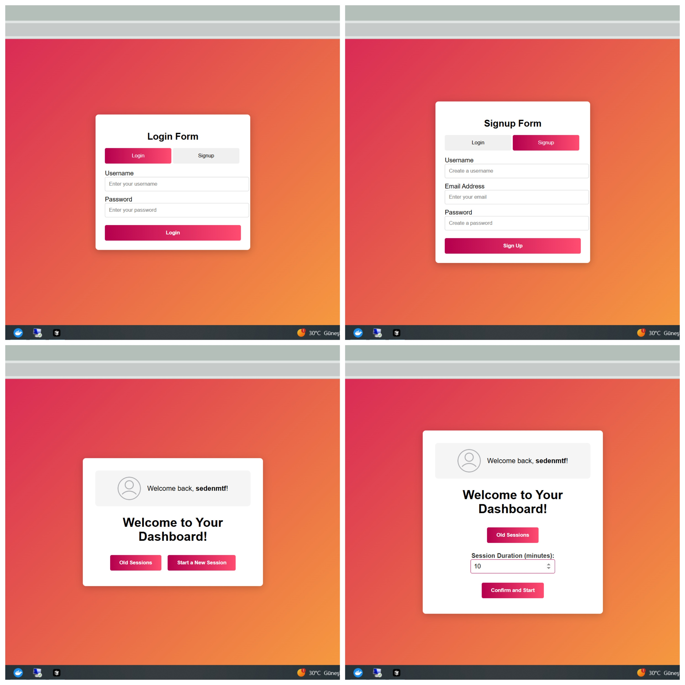

# 👁️ Real-Time Gaze & Activity Tracker with User Management

[](https://www.python.org/downloads/)

A full-stack web application that tracks users’ gaze and activity in real-time using a webcam. Built with **FastAPI** for the backend and a **React-based frontend**, it allows users to register, log in, start gaze tracking sessions, and view both real-time and historical activity data. All session data is stored and served from **Redis**.





---

## 🚀 Features

- ✅ **User Registration & Login**
- ✅ **Session Start/End & Activity Tracking**
- ✅ **Real-Time Gaze Direction Detection (OpenCV)**
- ✅ **Live WebSocket Feed**
- ✅ **Per-User Session History & Reports**
- ✅ **Redis for fast, lightweight session storage**
- ✅ **Frontend UI for Dashboard, Sessions, and More**
- ✅ **OpenAPI docs via Swagger UI**

---

## 🧱 Tech Stack

| Layer      | Technology                  |
|------------|-----------------------------|
| Backend    | FastAPI                     |
| Frontend   | React                       |
| Real-time  | WebSocket (FastAPI)         |
| CV Engine  | OpenCV (MediaPipe)          |
| Storage    | Redis                       |
| Auth       | Custom (basic hashed passwords) |
| Docs       | Swagger UI (`/docs`)        |

---

## 🧠 Architecture Overview

```

Frontend (React) <--> FastAPI (REST/WebSocket) <--> Redis (Sessions & Users)
↑
Gaze Tracker
(OpenCV)

```

---

## 📁 Project Structure

```

project-root/
│
├── backend/
│   ├── app/
│   │   ├── api/
│   │   │   ├── session.py        # Session logic
│   │   │   ├── tracking.py       # WebSocket activity streaming
│   │   │   └── user.py           # Auth & user handling
│   │   ├── models/
│   │   │   ├── session\_models.py # Session schemas
│   │   │   ├── activity\_models.py# WebSocket schema
│   │   │   └── user\_models.py    # Auth schemas
│   │   └── utils/
│   │       └── redis\_utils.py    # Redis connection helper
│   └── main.py                   # FastAPI app entry
│
├── frontend/
│   ├── public/
│   └── src/
│       ├── components/           # UI components (Login, Dashboard, etc.)
│       └── App.js                # Main React app entry
│
└── README.md

````

---

## 🛠️ Setup Instructions

### ⚠️ Python Version Compatibility

> **Important:** The backend requires **Python 3.10 or lower** due to the compatibility limitations of the **MediaPipe** framework.  
> Be sure to use **Python 3.10**, **3.9**, or an earlier version when creating your virtual environment.

---

### 1. 🔀 Clone the Repo
```bash
git clone https://github.com/your-username/activity-tracker.git
cd activity-tracker
````

---

### 2. 📦 Backend Setup

#### a. Create a virtual environment (with Python ≤3.10)

```bash
cd backend
python3.10 -m venv venv
source venv/bin/activate   # On Windows: venv\Scripts\activate
```

#### b. Install dependencies

```bash
pip install -r requirements.txt
```

#### c. Start Redis (with Docker)

```bash
docker run -d --name redis -p 6379:6379 redis
```

#### d. Run the FastAPI app

```bash
uvicorn backend.main:app --reload
```

---

### 3. 💻 Frontend Setup

The frontend is built using React and provides:

* Login page
* Dashboard
* Session creation and control
* Ongoing session viewer
* History of old sessions

#### a. Install dependencies

```bash
cd ../frontend
npm install
```

#### b. Run the frontend

```bash
npm start
```

The frontend should now be available at [http://localhost:3000](http://localhost:3000)

---

## 📡 API Endpoints Overview

### 🧝‍♂️ User Management

| Method | Endpoint            | Description           |
| ------ | ------------------- | --------------------- |
| POST   | `/users/register`   | Register a new user   |
| POST   | `/users/login`      | Login existing user   |
| GET    | `/users/{username}` | Get user profile info |

### 📋 Session Management

| Method | Endpoint              | Description                       |
| ------ | --------------------- | --------------------------------- |
| POST   | `/session/start`      | Begin a new session               |
| POST   | `/session/end`        | End a session and generate report |
| GET    | `/session/{id}`       | Fetch session details             |
| GET    | `/sessions`           | All sessions                      |
| GET    | `/sessions/user/{id}` | Sessions for a specific user      |

### 🌐 Real-Time Activity

| Type      | Endpoint                         | Description                 |
| --------- | -------------------------------- | --------------------------- |
| WebSocket | `/ws/session/{session_id}/track` | Stream gaze + activity live |

---

## 📊 Example Session Report

```json
{
  "session_id": "abc123",
  "focus_time": 1400,
  "distraction_time": 300,
  "session_report": {
    "reading_time": 800,
    "browsing_time": 400,
    "watching_time": 200
  }
}
```

---

## 🔐 Auth Notes

* Passwords are hashed (simplified — you should upgrade to `bcrypt` in production).
* JWT/token support can be added later if desired.
* User IDs are UUID-based and tied to session ownership.

---

## 🌟 Future Enhancements

* [ ] Add face recognition per user
* [ ] Improve activity classification (AI-based)
* [ ] Export reports as CSV/PDF
* [ ] Token-based auth (JWT)
* [ ] Gaze calibration and accuracy improvements

---

## 📃 License

MIT © 2025 Seden Mutaf

```


